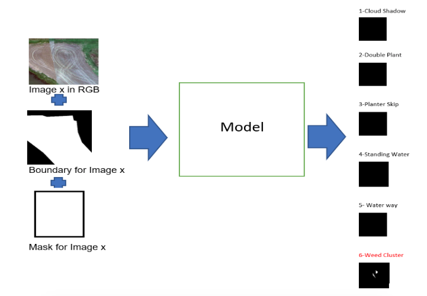

# Agriculture Anomaly Image Classification

## Abstract
  Convolution neural networks (CNN) have been extensively used in automatic image classification systems. 
  Nowadays, large amounts of high resolution remote-sensing images are gathered daily. 
  However, we can use this remote sensing images or particularly satellite image classification for many 
  applications which include tracking the growth of a city and changes in agricultural farmland or forests over several years or decades. 
  Many researchers introduce and discuss this domain but still, the sufficient and top-notch results have not been achieved yet. 
  Hence, this project focuses on evaluating currently available and different common techniques used for satellite image classification. 
  Thus, the experiments, in this project, carried out on one of the popular deep learning models, Convolution Neural Networks (CNNs), 
  precisely using Transfer learning (Inception and VGG 19) architecture on a standard dataset, Agriculture Vision Database. 
  Finally, a comparison with other different techniques is introduced.
  
  ## Problem Description
   In this project, the main focus is to detect/locate the anomalies such as cloud shadow, double plant, planter skip, standing water, 
   water way and weed cluster in the farmland as this affects the yield of the farmland. 
   The goal of this project is to classify the images into one of the six categories.  
   The aim is to find/build the Deep learning (Neural Network) model that will help us classify the image into one of the six categories with high accuracy.
    
  ## Dataset Description
  The dataset used in this project is a subset of the Agriculture-Vision dataset. 
  The challenge dataset contains 21,061 aerial farmland images captured throughout 2019 across the US. 
  Each image consists of four 512x512 color channels, which are RGB and Near Infra-red (NIR). 
  Each image also has a boundary map and a mask. 
  The boundary map indicates the region of the farmland, and the mask indicates valid pixels in the image. 
  Regions outside of either the boundary map or the mask are not evaluated. 
  These types of field anomalies have great impacts on the potential yield of farmlands; therefore it is extremely important to accurately locate them. 
  In the Agriculture-Vision dataset, these six patterns are stored separately as binary masks due to potential overlaps between patterns. 
  This dataset contains six types of annotations: Cloud shadow, Double plant, Planter skip, Standing Water, Waterway and Weed cluster. 
  Each field image has a file name in the format of (field id)_(x1)-(y1)-(x2)-(y2).(jpg/png). 
  Each field id uniquely identifies the farmland that the image is cropped from, and (x1, y1, x2, y2) is a 4-tuple indicating the position in which the image is cropped.
  The flow of the classification model/s is as follows:-
    
 
    
  ## Models Developed:

  o Base Model (Only CNN)

  o Fine Tuning with VGG16 Model

  o Resnet InceptionV2 Model with Oversampling

  o Depthwise Seperable Model

  o Fine Tuning with VGG19 Model

  o VGG19 Model with Oversampling

  o Densenet Model
  
  ## Model Comparision

 
